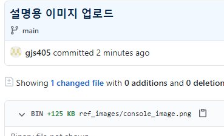

# HTML 학습 리포지토리
HTML5 / CSS3 / JS 학습용 리포지토리


-----------------

## HTML5
----------------
-
HTML 기본 학습

### HTML이란?
개요학습중.
1. *HTML 정의*
2. **HTML 역사**
3. ~HTML5의 차이점~

- [x] 학습하기
- [ ] 복습하기
~~~
- HTML 정의
- HTML 역사
- HTML5의 차이점
  - UL2
  - UL3
~~~

```csharp
using System;

namespace HelloWorldApp
{
    class Program
    {
        static void Main(string[] args)
        {
            Console.WriteLine("Hello World!");
        }
    }
}
```
실행결과


```

```


🤣🤣🤣

참조링크
-----
- [Microsoft](https://www.microsoft.com)
- [Naver](https://www.naver.com)
-------------
## CSS3
CSS 기본학습

> CSS is Cascading Style Sheets.

`테스트 코드`

-------------
## Javascript
Javascript 기본 학습

----------------
## Responsive Web
응답형 웹 기본 학습

---------------------
## Project
전체 통합 프로젝트

------------------------
문의메일 : <gjs405@naver.com>
